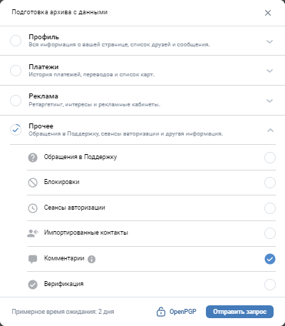

# RemoveComVK

Приложение для Windows, которое позволяет удалить все комментарии из ВКонтакте.

## **Актуальность**
Актуальность приложения, очевидна на настоящее время. Один неосторожно оставленный комментарий в ВК, может послужить основанием для возбуждения кого или чего-либо. Допустим, даже если вы просто, хотите удалить все свои комментарии, не имея на то причин. Внутренним функционалом ВК, не предусмотренно данное действие. Так, что приложение актуально на настоящий момент.

## **Будущие обновления**
Их нет

## **Требования**
- WINDOWS OC не ниже 7

## **Отказ от ответственности и бла... бла...**
Автор отказывается от какой-либо ответственности. Все делайте на свой страх и риск. Все предоставляется "as is" (как есть).

## **Как удалить все свои комментарии (Step By Step)**

### **1. Подготовка**
Еще до скачивания программы, за 1-2 дня Вам необходимо запросить ваш архив с данными из ВК.
Запросить архив можно, перейдя по ссылке ниже с ДЕСКТОПА (компьютера/ноутбука).

**Необходимо выбрать выгрузку ТОЛЬКО комментариев (см. скриншот снизу).**

**[Запросить архив](https://vk.com/data_protection?section=rules#archive)**

Спустя некоторое время (1-3 дня) вы получите ссылку на ваш архив.

### **2. Скачайте ваш архив из ВК**
Разархивировать его не нужно.

### **3. Скачайте приложение RemoveComVK для Windows** 
Работа на Windows 11, 10. Должно работать еще и на 8, 7 версиях, но не проверял

**[Скачать приложение](https://github.com/i9a4/RemoveComVK/releases/download/v1.0.0/RemoveComVK_1_0_0_4.zip)**

### **4. Запустите его**
Запустите файл с расширением .exe (знаю, что там очень много файлов в компиляции, это из-за некоторых особенностей).

### **5. Далее необходима авторизация для работы с методами ВК, которые позволят удалять комментарии**

Есть два метода авторизации:

1. Авторизация через VK - походит для всех

2. Авторизация по токену - подходит для опытных юзеров, уже имеющих токен

Так как приложение использует токен для работы с ВК, ему необходим ключ (токен) для авторизации доступа. Соответственно, предусмотрено два способа его получения. 

В первом случае, авторизация происходит через встроенный движок браузера - Microsoft Edge. Все данные (куки и т.д) после закрытия окна с браузером, будут удалены. В окне, вы как обычно авторизуйтесь и даете разрешение на предоставление токена.
Почему, разрешения запрашивает VK Admin? Ответ: из-за политики ВК, только определенные приложения могут получать ключи с необходимыми разрешениями. Приложение получает ключ посредством представления ВК от имени другого приложения VK.

Во втором случае, авторизация происходит непосредственно токеном, который предоставил сам пользователь. 
**ВАЖНО! Токен должен иметь значение scope, больше чем 8192 (доступ на работу со стеной)**
В случае если токен не подходит, приложение вам об этом сообщит.

### **6. Выберите скаченный архив с комментариями из ВК**
Он не должен иметь какую-либо защиту (пароля и т.п)

### **7. Конец**
Откроется окно, в котором вы можете выбирать определенные комментарии для удаления или удалить их всех. Есть возможность поиска по словам и возможность открытия комментария в браузере.

## **Особенности работы программы**

~~При удалении, те комментарии, которые не были удалены по каким-то причинам, они остануться в списке. Обычно, ошибка из-за того, что комменатрий уже удален. Когда-то, возможно это будет исправлено~~. **Исправлено**. 

Если при удалении, какие-то комментарии не будут удалены, то они останутся в списке.

Какие комментарии считаются удаленными?
 - Те, которые были удалены сейчас
 - Те, которые были удалены ранее

## **Остались вопросы?** Милости прошу [сюда](https://github.com/i9a4/RemoveComVK/issues)
